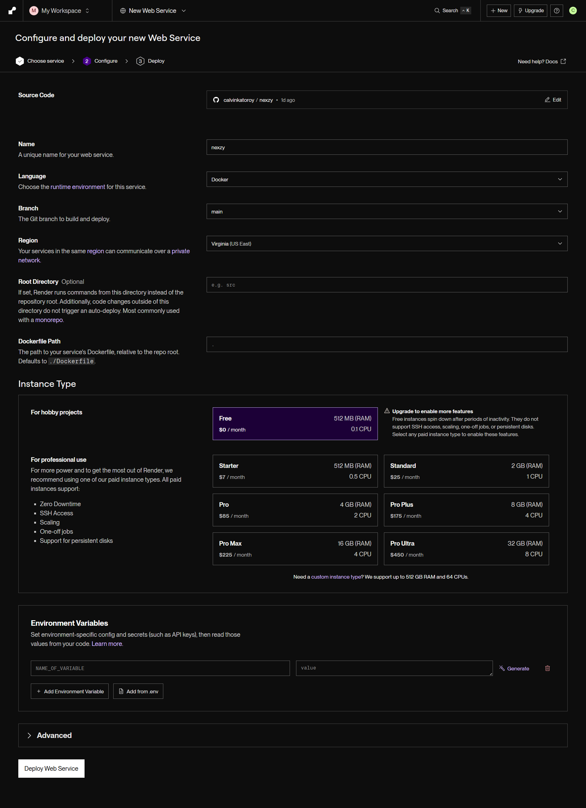

# 🛡️ Nexzy - OSINT Credential Leak Detection System

<div align="center">


**AI-Powered credential leak detection for educational institutions and organizations**

[](LICENSE)
[](https://www.python.org/)
[](https://reactjs.org/)
[](https://fastapi.tiangolo.com/)

[Features](#-features) • [Demo](#-demo) • [Installation](#-quick-start) • [Documentation](#-documentation) • [Contributing](#-contributing)

</div>

---

## 📖 Overview

**Nexzy** is an advanced OSINT (Open Source Intelligence) platform designed to detect and monitor credential leaks across public paste sites and darkweb sources. Built specifically for educational institutions and organizations to protect their digital assets and student data.

### ✅ Current Status (December 2025)

**Fully Functional & Production Ready:**
- ✅ Complete AI-powered vulnerability scoring (0-100 scale)
- ✅ Real-time WebSocket notifications and dashboard updates
- ✅ Multi-source paste site monitoring (clearnet + darkweb)
- ✅ Advanced UI with glass-morphism design and animations
- ✅ Docker containerization for easy deployment
- ✅ Comprehensive testing suite with IEEE 829 compliance
- ✅ Command palette for quick actions
- ✅ Content snippets and detailed AI analysis

**Recent Improvements:**
- 🔧 Fixed severity display with numeric RoBERTa scores
- 📊 Enhanced dashboard stats with accurate calculations
- 🎯 Added graph tooltips for detailed insights
- 🤖 Implemented AI depth analysis with confidence levels
- ⚡ Added command palette quick scan functionality
- 📝 Added paste content snippets for preview

---

- 🔍 **Automated Scanning** - Search clearnet & darkweb paste sites automatically
- 🤖 **AI-Powered Analysis** - Gemini AI scores vulnerabilities (0-100) with detailed mitigation
- 🚨 **Real-Time Alerts** - WebSocket-based instant notifications with content snippets
- 🌐 **Multi-Source Discovery** - Pastebin, darkweb mirrors, author crawling
- 📊 **Interactive Dashboard** - Modern UI with real-time stats, tooltips, and analytics
- 🛡️ **Smart Detection** - Pattern matching for NPM, emails, passwords, API keys, PII
- ⚡ **Command Palette** - Quick scan actions with keyboard shortcuts
- 🎨 **Advanced UX** - Glass-morphism design with smooth animations

---

## ✨ Features

### 🔎 Advanced Discovery Engine

- **Keyword Search** - Search paste sites by domain/keywords (e.g., `ui.ac.id`)
- **Pastebin Search Integration** - Direct search using Pastebin's search functionality
- **Darkweb Monitoring** - Scan darkweb paste sites via clearnet mirrors
- **Author Crawling** - Follow paste authors to discover related leaks
- **Direct URL Scanning** - Analyze specific paste URLs

### 🤖 AI-Powered Intelligence

- **Vulnerability Scoring** (0-100) - Automated risk assessment using Gemini AI
- **Smart Summarization** - One-sentence leak descriptions
- **Signal Detection** - Identifies passwords, API keys, database credentials, PII, etc.
- **Mitigation Recommendations** - Actionable steps (Immediate, Short-term, Long-term)
- **Risk Rationale** - Detailed explanations of threats

### 📊 Real-Time Monitoring

- **WebSocket Notifications** - Live scan progress updates
- **Scan Logs Viewer** - Detailed execution logs with timestamps
- **Multi-University Support** - Configure target domains and keywords per user
- **Quick Scan** - One-click scanning with saved settings

### 🎨 Modern User Experience

- **Interactive Dashboard** - Stats, alerts, recent activity
- **Alert Management** - View, investigate, and resolve alerts
- **Advanced Search** - Filter alerts by severity, status, date
- **Dark Theme** - Beautiful glass-morphism design
- **Responsive UI** - Works on desktop and mobile
- **Command Palette** - Quick actions with ⌘K / Ctrl+K shortcuts

### 🚀 Advanced Features

- **AI Depth Analysis** - Detailed vulnerability scoring (0-100) with confidence levels
- **Content Snippets** - Preview first 500 characters of leaked content
- **Graph Tooltips** - Hover over charts for detailed insights
- **Real-Time WebSocket Updates** - Live scan progress and notifications
- **Multi-Source Intelligence** - Clearnet and darkweb paste monitoring
- **Automated Remediation** - AI-generated mitigation recommendations

---

## 🚀 Quick Start

### Prerequisites

- **Python 3.10+** (Backend & AI Service)
- **Node.js 18+** (Frontend)
- **Supabase Account** (Database & Auth)
- **Gemini API Key** (AI Features - FREE tier available)

### 1. Clone Repository

```bash
git clone https://github.com/yourusername/nexzy.git
cd nexzy
```

### 2. Backend Setup

```bash
cd nexzy-backend
pip install -r requirements.txt
```

Create `.env`:
```env
SUPABASE_URL=your_supabase_url
SUPABASE_SERVICE_ROLE_KEY=your_service_role_key
SUPABASE_JWT_SECRET=your_jwt_secret
AI_SERVICE_URL=http://localhost:8000
```

Run database migrations:
```sql
-- Run SQL from nexzy-backend/supabase_schema.sql in Supabase SQL Editor
```

Start backend:
```bash
python -m uvicorn api.main:app --reload --host 127.0.0.1 --port 8001
```

### 3. Frontend Setup

```bash
cd nexzy-frontend
npm install
```

Create `.env`:
```env
VITE_SUPABASE_URL=your_supabase_url
VITE_SUPABASE_ANON_KEY=your_anon_key
```

Start frontend:
```bash
npm run dev
```

### 4. AI Service Setup (Optional but Recommended)

```bash
cd ai-service
pip install -r requirements.txt
```

Create `.env`:
```env
GEMINI_API_KEY=your_gemini_api_key
```

Get free API key: [Google AI Studio](https://aistudio.google.com/app/apikey)

Start AI service:
```bash
python -m uvicorn main:app --host 127.0.0.1 --port 8000
```

### 5. Access Application

- **Frontend**: http://localhost:5173
- **Backend API**: http://127.0.0.1:8001
- **AI Service**: http://127.0.0.1:8000
- **API Docs**: http://127.0.0.1:8001/docs

---

## 📸 Demo

### Dashboard

*Real-time monitoring dashboard with stats and alerts*

### Alert Details

*Detailed alert view with AI analysis and mitigation recommendations*

### Scan Management

*Configure and launch scans with multiple options*

---

## 🏗️ Architecture

```
nexzy/
├── nexzy-frontend/          # React + Vite frontend (Port 5173)
│   ├── src/
│   │   ├── components/      # Reusable UI components
│   │   ├── pages/           # Page components
│   │   ├── lib/             # API client, utilities
│   │   └── contexts/        # React contexts (Auth, Toast)
│   └── package.json
│
├── nexzy-backend/           # FastAPI backend (Port 8001)
│   ├── api/                 # API endpoints
│   │   └── main.py         # Main FastAPI app
│   ├── lib/                # Core libraries
│   │   ├── auth.py         # JWT authentication
│   │   ├── ai_client.py    # AI service client
│   │   └── supabase_client.py
│   ├── scrapers/           # OSINT scrapers
│   │   └── discovery_engine.py
│   ├── config.py           # Configuration
│   └── requirements.txt
│
├── ai-service/             # AI scoring microservice (Port 8000)
│   ├── main.py            # Gemini API integration
│   └── requirements.txt
│
└── docs/                  # Documentation
    ├── setup/            # Setup guides
    ├── features/         # Feature documentation
    └── guides/           # User guides
```

### Tech Stack

**Frontend:**
- React 19.2.0
- Vite 7.2.4
- Tailwind CSS 4.1.17
- React Router DOM 7.9.6
- Anime.js 4.2.2
- Lucide React 0.555.0

**Backend:**
- FastAPI 0.115.12
- Supabase 2.86.0
- Uvicorn 0.34.0
- BeautifulSoup4 4.12.0
- SlowAPI 0.1.9

**AI Service:**
- Google Gemini 2.0 Flash
- FastAPI 0.115.12
- Transformers 4.36.0
- LangChain Google GenAI

---

## 📚 Documentation

### Setup Guides
- [Complete Setup Guide](docs/setup/SETUP_COMPLETE.md)
- [Database Setup & Migration](docs/setup/SCHEMA.md)
- [AI Service Configuration](docs/setup/AI_SERVICE_SETUP.md)
- [Integration Guide](docs/setup/INTEGRATION.md)

### Feature Documentation
- [Pastebin Search Feature](docs/features/PASTEBIN_SEARCH_FEATURE.md)
- [Darkweb Monitoring](docs/features/DARKWEB_FEATURE_GUIDE.md)
- [One-Click Scanning](docs/features/ONE_CLICK_SCAN_GUIDE.md)
- [Scan Notifications](docs/features/SCAN_NOTIFICATIONS_UPDATE.md)
- [Wow Factor Features](docs/WOW_FACTOR_FEATURES.md)

### User Guides
- [Quick Reference](docs/QUICK_REFERENCE.md)
- [Auto Discovery Guide](docs/guides/AUTO_DISCOVERY_GUIDE.md)
- [Proof of Concept Guide](docs/guides/PROOF_OF_CONCEPT_GUIDE.md)

### API Documentation
- Interactive API docs: http://127.0.0.1:8001/docs
- ReDoc: http://127.0.0.1:8001/redoc

---

## 🎯 Use Cases

### Educational Institutions
- Monitor student credential leaks
- Protect university email domains
- Detect database dumps with student data
- Automated breach notifications

### Organizations
- Corporate credential monitoring
- API key leak detection
- Employee data protection
- Compliance requirements

### Security Research
- OSINT investigations
- Breach analysis
- Threat intelligence gathering
- Vulnerability assessment

---

## 🔒 Security & Privacy

- **No Data Collection** - Only scans public sources
- **Encrypted Storage** - All credentials hashed
- **JWT Authentication** - Secure user sessions
- **Rate Limiting** - API abuse prevention
- **RLS Policies** - Row-level security in database
- **CORS Protection** - Restricted origins

---

## 🛠️ Development

### Project Structure
```
nexzy/
├── README.md                    # This file
├── LICENSE                      # MIT License
├── .gitignore                   # Git ignore rules
├── docs/                        # Documentation
├── image/                       # Screenshots & assets
├── nexzy-frontend/              # React frontend
├── nexzy-backend/               # FastAPI backend
└── ai-service/                  # AI microservice
```

### Running Tests

**Backend:**
```bash
cd nexzy-backend
pytest tests/
```

**Frontend:**
```bash
cd nexzy-frontend
npm test
```

### Code Style

- **Python**: PEP 8, Black formatter
- **JavaScript**: ESLint, Prettier
- **Commits**: Conventional Commits

---

## 🤝 Contributing

Contributions are welcome! Please follow these steps:

1. Fork the repository
2. Create a feature branch (`git checkout -b feature/AmazingFeature`)
3. Commit changes (`git commit -m 'Add AmazingFeature'`)
4. Push to branch (`git push origin feature/AmazingFeature`)
5. Open a Pull Request

Please read [CONTRIBUTING.md](CONTRIBUTING.md) for details.

---

## 📝 License

This project is licensed under the MIT License - see the [LICENSE](LICENSE) file for details.

---

## 🚀 Deployment

### Local Development
Use the convenience script to start all services:
```bash
.\start-all.ps1
```

### Docker Deployment
For production-ready containerized deployment:
```bash
docker-compose up -d
```

### Cloud Deployment Options

| Platform | Cost | Setup Time | Best For |
|----------|------|------------|----------|
| **Railway** | $5/month | 15 min | Easiest production |
| **Render** | Free tier | 10 min | Free hosting |
| **DigitalOcean** | $4+/month | 20 min | Full control |

**Recommended for production:** Railway (automated deployments, monitoring, scaling)

See [DOCKER_DEPLOYMENT_GUIDE.md](DOCKER_DEPLOYMENT_GUIDE.md) for detailed instructions.

---

## 🙏 Acknowledgments

- [FastAPI](https://fastapi.tiangolo.com/) - Modern web framework
- [React](https://reactjs.org/) - UI library
- [Supabase](https://supabase.com/) - Backend as a Service
- [Google Gemini](https://ai.google.dev/) - AI analysis
- [Tailwind CSS](https://tailwindcss.com/) - Styling
- [Anime.js](https://animejs.com/) - Animations

---

## 📧 Contact & Support

- **Issues**: [GitHub Issues](https://github.com/yourusername/nexzy/issues)
- **Discussions**: [GitHub Discussions](https://github.com/yourusername/nexzy/discussions)
- **Email**: support@nexzy.dev

---

## 🌟 Star History

If you find Nexzy useful, please consider giving it a star ⭐

[](https://star-history.com/#yourusername/nexzy&Date)

---

<div align="center">

**Built with ❤️ for cybersecurity and education**

[⬆ Back to Top](#-nexzy---osint-credential-leak-detection-system)

</div>
